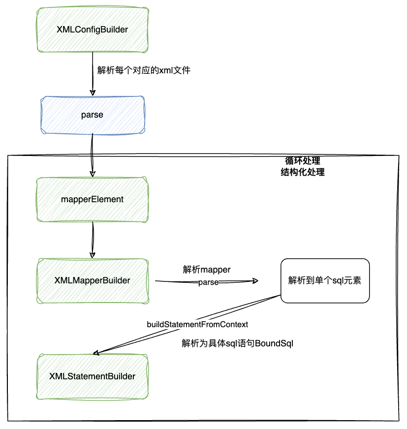

# 解藕xml解析代码

## 一、前言

目前的xml文件耦合度较高，所有的解析内容全部在一个方法中(builder/xml/mapperElement.java)，这也违背了学习mybatis源码的初衷，学习框架源码如果没有学习其中的代码设计的话自知道业务流程的话其实并不算是学习框架源码，应该学习其中的代码设计才能提升我们写代码的质量和水平

前期就进行代码解藕优化的话等后面更新迭代的时候就会轻松很多，就比如这一章的代码可能解藕前就`2个类`，解藕后就变成了`18个类`甚至更多，并且代码也随之增多了，因为当前我们代码中也只实现了解析select的标签的语句，如果在实现路update、insert等语句，那么这个方法中的代码可能就会成倍的增加，后期维护可能也会很困难，如果优化后，后期进行增加新功能的时候就不会进行太多调试debug，代码耦合并不是代码多的时候才会耦合，可能一个方法中就不到10行代码，实际上的代码也是高度耦合的，如果后期新增其他功能的时候就会越来越臃肿

## 二、目标

目前代码中是一层一层的代码，目标是这一层代码只需要获取每个mapper的xml文件路径即可，然后通过其他的类进行进一步的解析

```java
/**
     * <mappers>
     *         <mapper resource="mapper/User_Mapper.xml"/>
     *         <mapper resource="mapper/Home_Mapper.xml"/>
     * </mappers>
     * @param mappers
     * @throws Exception
     */
    private void mapperElement(Element mappers) throws Exception {
        System.out.println(mappers.getName());
        List<Element> mapperList = mappers.elements("mapper");
        for (Element e : mapperList) {
            String resource = e.attributeValue("resource");
            Reader reader = Resources.getResourceAsReader(resource);
            SAXReader saxReader = new SAXReader();
            Document document = saxReader.read(new InputSource(reader));
            Element root = document.getRootElement();
            //命名空间
            String namespace = root.attributeValue("namespace");

            // SELECT
            List<Element> selectNodes = root.elements("select");
            for (Element node : selectNodes) {
                /**
                 * <select id="queryUserInfoById" parameterType="java.lang.Long" resultType="com.nbsb.mybatis.test.po.User">
                 *         SELECT id,name,age
                 *         FROM user
                 *         where id = #{id}
                 * </select>
                 */
                String id = node.attributeValue("id");
                String parameterType = node.attributeValue("parameterType");
                String resultType = node.attributeValue("resultType");
                String sql = node.getText();

                // ? 匹配
                Map<Integer, String> parameter = new HashMap<>();
                Pattern pattern = Pattern.compile("(#\\{(.*?)})"); //获取#{}中的内容
                Matcher matcher = pattern.matcher(sql);
                for (int i = 1; matcher.find(); i++) {
                    String g1 = matcher.group(1);//#{name}
                    String g2 = matcher.group(2);// whn
                    parameter.put(i, g2);//获取到参数，例如第一个参数中name填whn
                    sql = sql.replace(g1, "?");
                }

                String msId = namespace + "." + id;//方法的类，如：com.nbsb.mybatis.test.dao.IUserDao.queryUserInfoById
                String nodeName = node.getName();
                SqlCommandType sqlCommandType = SqlCommandType.valueOf(nodeName.toUpperCase(Locale.ENGLISH));
                BoundSql boundSql = new BoundSql(sql, parameter, parameterType, resultType);
                MappedStatement mappedStatement = new MappedStatement.Builder( configuration,msId, sqlCommandType, boundSql).build();
                // 添加解析 SQL
                configuration.getMappedStatements().put(mappedStatement.getId(), mappedStatement);
            }

            // 注册Mapper映射器
            Class<?> type = Resources.classForName(namespace); //将这个包名称加载成类
            configuration.getMapperRegistry().addMapper(type);
        }
    }
```

优化后的代码，将其放到其他类进行解析mapper和对应的语句

```java
private void mapperElement(Element mappers) throws Exception {
        System.out.println(mappers.getName());
        List<Element> mapperList = mappers.elements("mapper");
        for (Element e : mapperList) {
            String resource = e.attributeValue("resource");
            InputStream resourceAsStream = Resources.getResourceAsStream(resource);
            XMLMapperBuilder xmlMapperBuilder = new XMLMapperBuilder(resourceAsStream, configuration, resource);
            xmlMapperBuilder.parse();
        }
    }
```


## 三、设计





## 四、实现

## 五、总结

## 六、结果